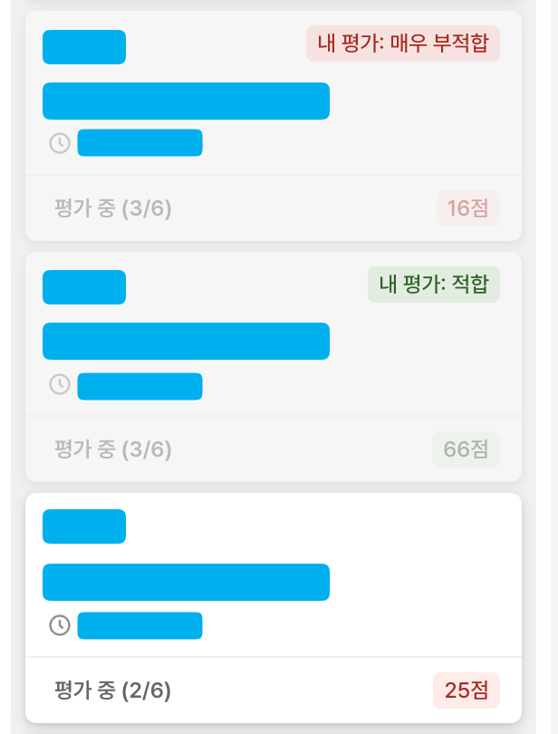

# Easy GreetingHR

그리팅HR 칸반 보드에서 내 평가 상태를 한눈에 확인할 수 있는 브라우저 스크립트



## 기능

- 칸반 카드에 내 평가 점수 배지 표시 (매우 부적합 ~ 매우 적합)
- 평가 완료 카드 흐리게 표시하여 미평가 카드와 시각적 구분
- 평가 완료 카드 숨기기/보이기 필터 토글 버튼
- 칸반 보드 갱신 시 자동으로 평가 상태 업데이트

## 북마크 등록

1. 아래 코드를 복사한다:
   ```
   javascript:void(fetch('https://raw.githubusercontent.com/ybbarng/easy-greetinghr/main/bookmarklet.js').then(r=>r.text()).then(t=>eval(t)))
   ```
2. 브라우저 북마크바에서 우클릭 → **페이지 추가**
3. **이름**에 `EasyGreetingHR`을 입력한다
4. **URL**에 위에서 복사한 코드를 붙여넣고 **저장**한다


## 사용 방법

> [!IMPORTANT]
> 페이지를 새로고침하면 스크립트가 초기화되므로 다시 클릭해야 합니다.

1. 그리팅HR 칸반 보드 페이지에 접속한다
2. 북마크바에 추가한 **EasyGreetingHR**을 클릭한다

<details>
<summary>콘솔에서 직접 실행하기</summary>

1. 그리팅HR 칸반 보드 페이지를 연다
2. 브라우저 개발자 도구를 연다 (`F12` 또는 `Cmd+Option+I`)
3. Console 탭에서 [`bookmarklet.js`](bookmarklet.js)의 내용을 붙여넣고 실행한다
</details>

## 문서

- [API 조사 결과](docs/api-research.md) — 그리팅HR API 구조 및 평가 데이터 판별 로직
